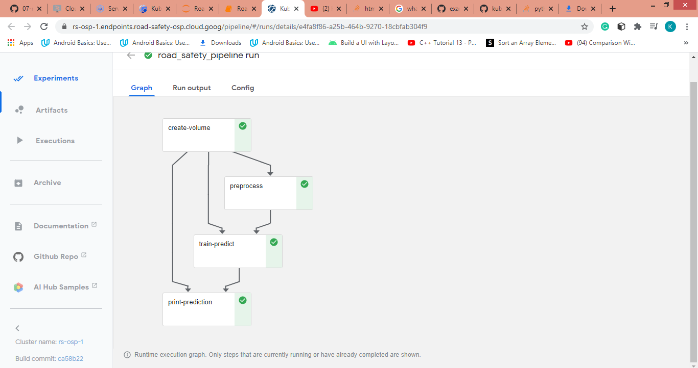
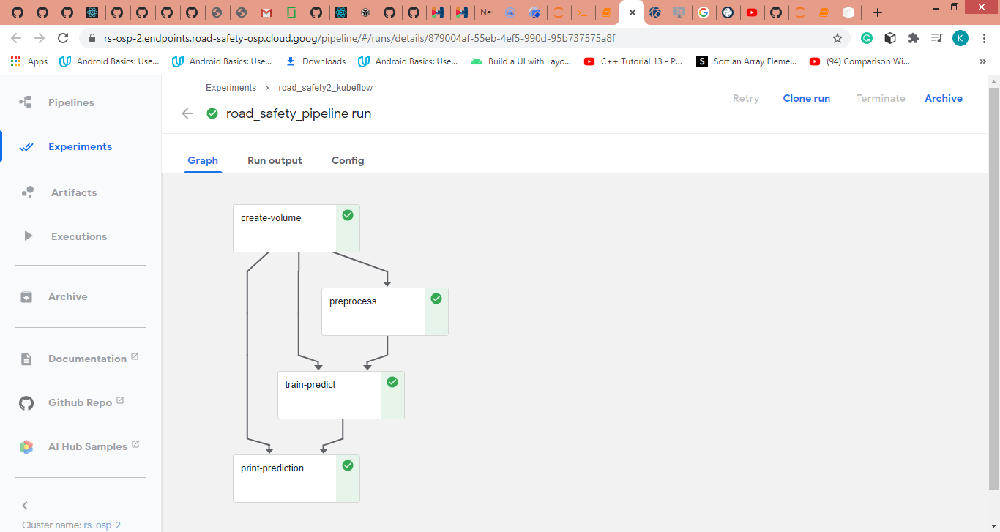

## Pipeline For Road Safety.

Built a pipleline on kubeflow deployed on the google cloud platform. Data is fetched from a repository, preprocessed and used in training a model for predictions. 

### Graph below shows the flow for the pipeline created for the random forest classifier

### Graph below shows the flow for the pipeline created for the Xgboost classifier

